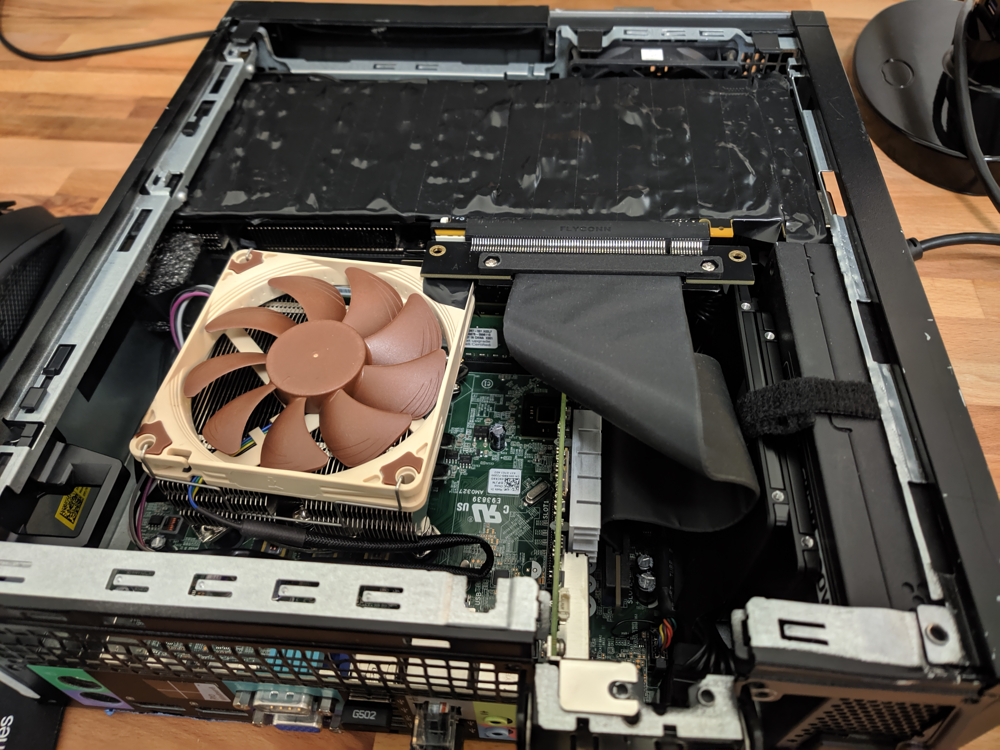
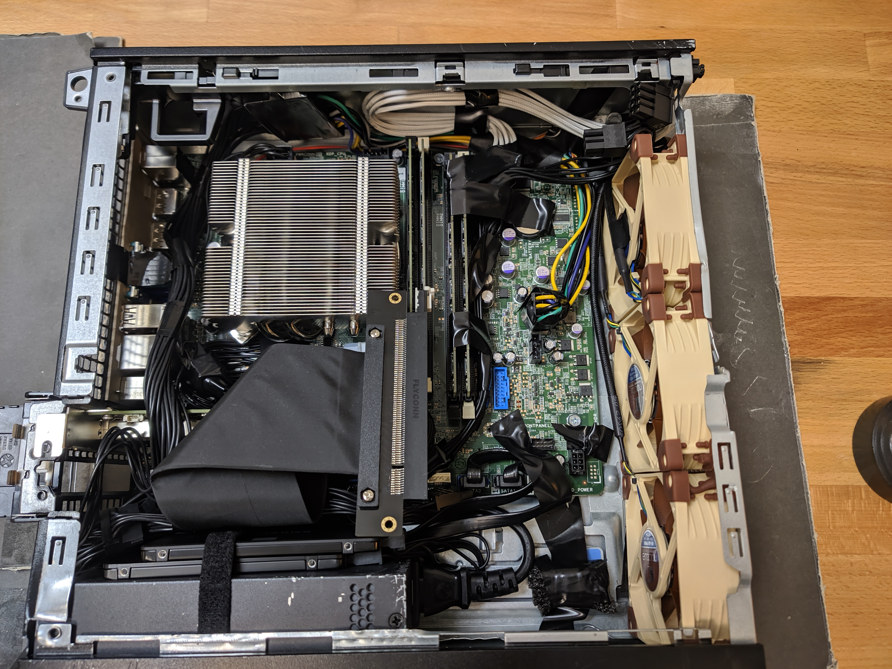

<h1 align="center" style="margin-top: 0px;">Arduino PWM Fan Control</h1>

    

---

I have an old dell optiplex 9020 into which I shoved a 2-slot, full-size, EVGA gtx 970. The layout's a bit cramped, and I wanted to upgrade the fans, while controlling them to spin faster when the computer gets hotter. Seems simple enough.

Dell, in their infinite wisdom, has bravely saved their corporate customers from adjusting the fan speed of these business desktops. Now, there are utilities for windows (and linux) which will control fan pwm if they can find the devices through the motherboard's firmware API. I could never get those to find Dell's fans - and even if they did, I want a cross-platform solution that doesn't need constant installing/configuration. And the final nail: these PCs use specialized Dell fans with a proprietary motherboard connector. I don't know how much power those headers can supply, nor do I know what signaling they use, if it's even standard (you can find the connectors on ebay, but it's not worth the headache).

Enter Arduino. I supply the arduino nano (clone) 5V directly from the computer's PSU. I put two simple thermistors on each the gpu and cpu (as close to the silicon as they will fit). I can then try to adjust the data from each thermistor to estimate the real value of these component's temperatures, and decide how fast the fans should blast (noctua NF-A9's). Then, write out the appropriate pwm signal to control those fans. I read somewhere that these thermistors run best at 3.3V. So, I use the arduino's 3.3V analog reference pin, and supply the thermistors with 3.3V from the arduino's power pin. These Noctua fans run on a DC supply of 12V, which I also pull directly from the computer's PSU.

As you can see from the "Noctua PWM Specifications White Paper" (under /doc), they use the Intel Spec (c.f. “4-Wire Pulse Width Modulation (PWM) Controlled Fans”, Intel Corporation September 2005, revision 1.3), which indicates a 5V PWM signal at 21 kHz to 28 kHz (25 kHz target). As far as I know, the arduino nano cannot supply PWM at 21+ kHz. However, I've not had any problems sending PWM at whatever default (lower) signal frequency arduino supplies on pin 5.

In /pwm_3V/arduino_pwm_3V.ino, you'll find the main loop I've used. I collect some number of samples, average them (to filter some noise from the thermistor readings), then apply a simple curve to estimate component temperature from the readings.

I fit a simple curve by running a stress test using aida64 in windows, and taking down some reported temps from hwinfo64. At the same times, I wrote down the temps reported by the thermistors for the stressed component (I tested cpu and gpu individually). You can see in /fit_curve/fit_curve.py the super quick and dirty way I fit a curve to this data, and copy/pasted those params into the .ino code.

Is this the most accurate or precise way of reading temps from components? No. However, the fans go faster when the components heat up, and that's really all I could have hoped for. As an added benefit, the fan speed will increase based on gpu temp, irrespective of drivers reporting that temp to the OS (a feature that would usually require extra software). I did verify that the machine will get much too hot, and thermally throttle, if I keep the noctua's at their minimum speed while stressing either the cpu or gpu. Conversely, they stay nice and cool with the arduino doing its thing. Success!

---

<h3 align="center" style="margin-top: 0px;">Compact PC, Now With *Smart* Brown-and-Tan Fans</h3>

    

